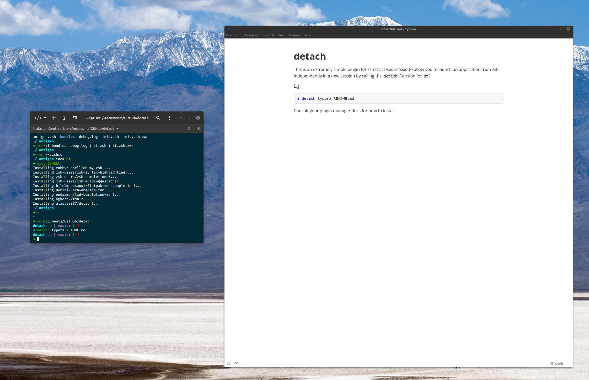

# detach

This is an extremely simple plugin for zsh that uses setssid to allow you to launch an application from zsh independently in a new session by calling the `detach` function (or `dt`). 

E.g.

```zsh
$ detach typora README.md
```



Consult your plugin manager docs for how to install.